### Result
Completed full zombie ragdoll project: 
https://github.com/BoQsc/godot-demo-projects/tree/zombie-ragdoll-walkthrough/3d/ragdoll_physics/character_zombie


### Start

---

CC Attribution Zombie model: https://sketchfab.com/3d-models/male-zombie-c86683678a2248b2bf142cf7c41eebde

Godot Ragdoll Physics Demo: https://github.com/godotengine/godot-demo-projects/tree/master/3d/ragdoll_physics

Tip: the manequin in the Demo is comparable to https://quaternius.itch.io/universal-animation-library and they are very similar standard, can be used interchangeably.

___
1. Open Godot Ragdoll Physics Demo project.
2. Create a new folder in the **godot-demo-projects/3d/ragdoll_physics/character_zombie**
3. Copy **male_zombie.glb** into /character_zombie folder
4. Create new 3D Scene **male_zombie.tscn**

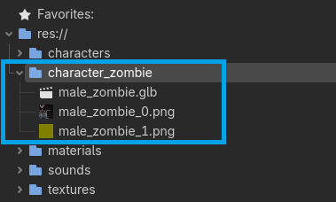

5. Copy **male_zombie.glb** file into the scene.

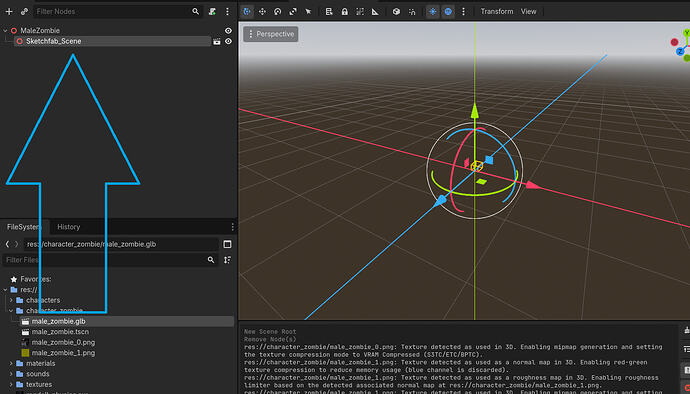

6. Mark **male_zombie.glb** as **Editable Children**

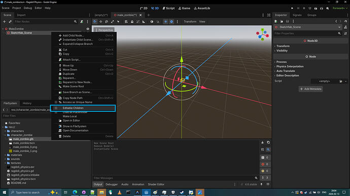

7. We are suspecting that this zombie model is quite small, let's compare to a standard model.
8. Let's use **pre-existing manequin model** to see if our zombie model might have incorrect size.

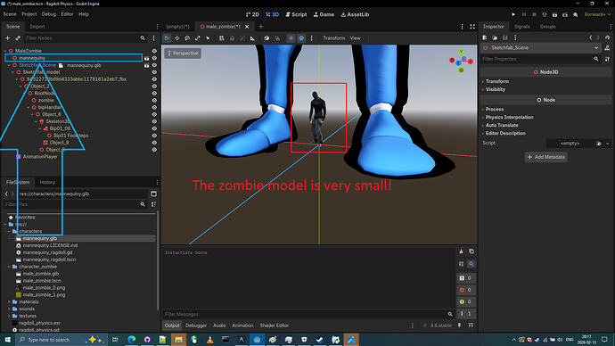

9. Detect the issue by looking at **Transform** (Scale) value of each node.

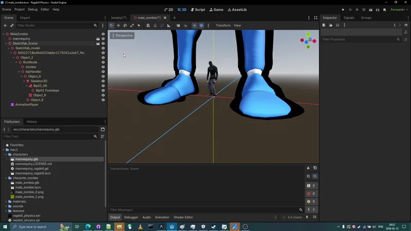

10. Aha! Zombie model was exported at **0.025** scale.

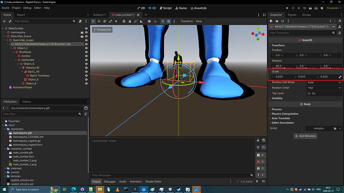

11. Let's set this  node transform (scale) to `1.0` and try putting this **0.25** number into **Root Scale**.

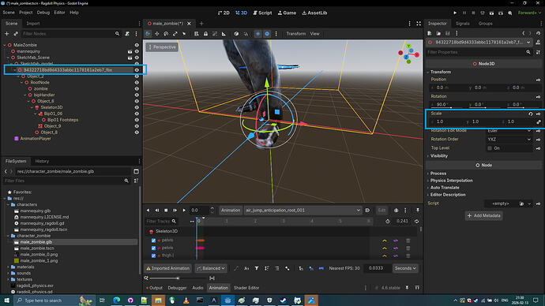

12. Let's put this **0.25** number into Root Scale of the  **male_zombie.glb** and click reimport.

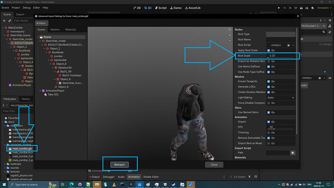

13. Zombie model is now in proper similar size, let's delete the Manequin.

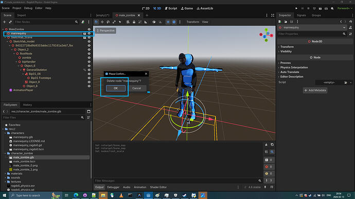

14. Let's create a **Physical Skeleton** by clicking on **Skeleton3D** 

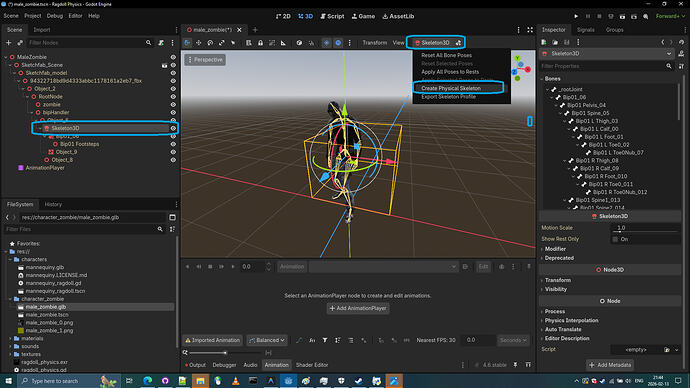

15. Let's inspect the **Physical Skeleton** by clicking on **Perspective** button and selecting **Display Overdraw**.

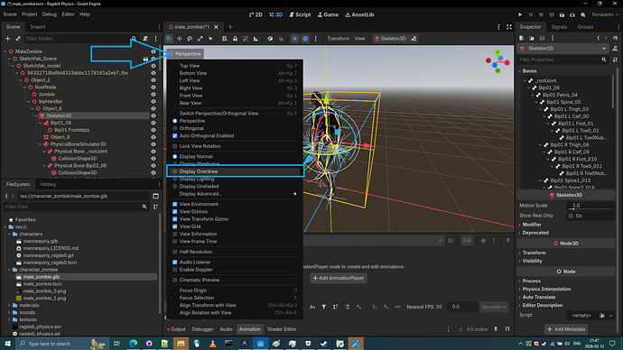

16. Let's look at the first created `Physical Bone _rootJoint`, it is clearly a bone that will obstruct legs. Let's remove it.

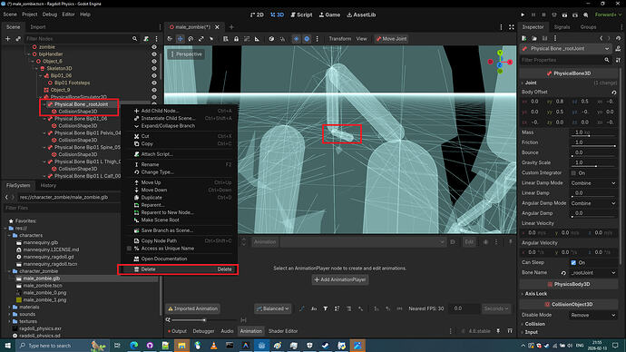

17. Let's see inspect the next bone. **Physical Bone Bip01_06** this one seems invisible to our eyes.

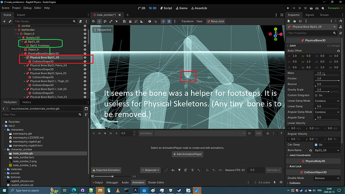

18. **Info:** "These kind of random bad bones might affect our Physical Skeleton behaviour, that's why we delete them. It's some kind of bone attachment... Not even a regular bone"

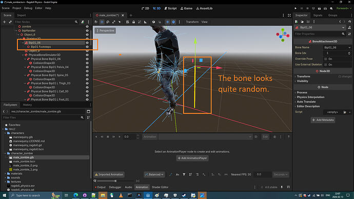

19. Alright let's take a look at next Physical Bone. This one seems alright. however a thing near it seems strange.

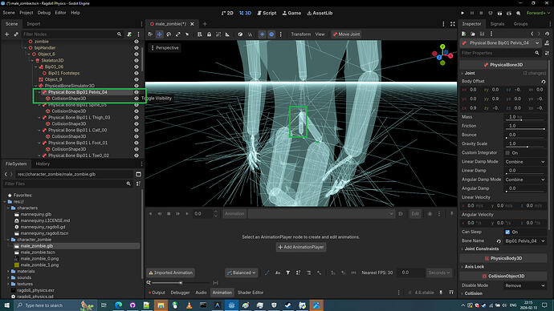

20. The strange bone next to it appears to be `Physical Bone Bip01 Spine_05` we should try correcting it.


21.Let's try correct it by using **Body Offset** rotations until it looks like proper spine.


22. Now let's drag it into correct position where a spine would belong.


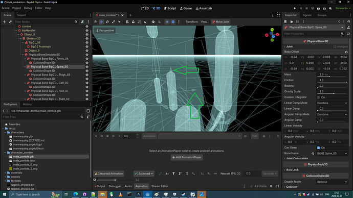

23. Great! After a few adjustments to physical bones: spine bone and pelvis bone **we hopefully didn't make any mistakes: rotating it in wrong directions as that might cause twisting of zombie itself.** (But don't worry, if we see some twisting of zombie mesh, we can delete it later on, the Physical Skeleton can work with two spine bones anyways.)

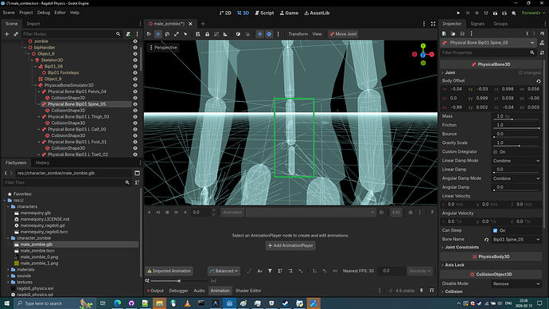

24. Now. The rest of the Physical bones seems to be correct. Let's continue correcting our zombie bones to match our zombie mesh.


25. Let's change size of the Physical Bones. The spine bone should end up large and other bones even going above the zombie mesh. The larger the bones, the better it is. We change physical bone size of the zombie model so that zombie model would not just be a **spaghetti physical skeleton** but a big bones guy where entire chest is a big bone not a spaghetti.

Tip: We might need to increase "Physical Ticks Per second " in Godot Settings to catch small bones going through the floor.

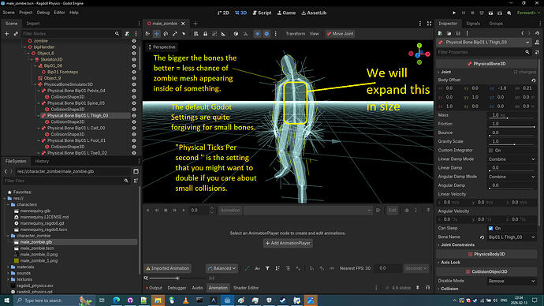


26. Let's go back to the **Display Normal** perspective.

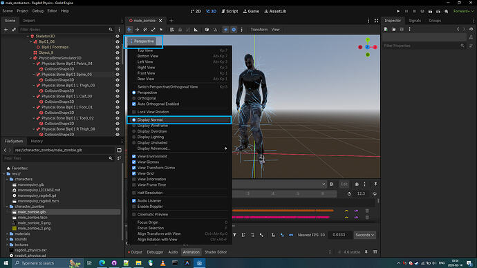


27. Let's look at the next bone, `Physical Bone Bip01 L Thigh_03` and change physical bone size of the zombie model so that zombie model would not end up just be a spaghetti physical skeleton. 

28. **Let's use the Scaler Mode.** and click on **CollisionShape3D** of a PhysicalBone
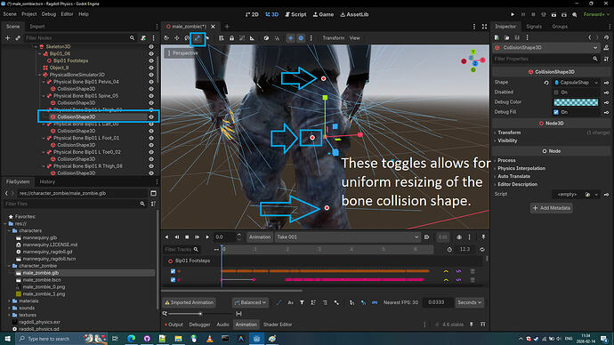

29. My internal unverified rules for the workflow: 
I change the **physical bones size** by only adjusting **CollisionShape3D** of the PhysicalBone. 
I change **physical bone position and rotation** by adjusting the **PhysicalBone itself**. 
I have no answers if this is correct or wrong, this is simply what I do. 

Note: I delete the toe, it's again a small bone that has nothing to do with physical skeletal appearance of the zombie. (`Physical Bone Bip01 R Toe0_011` and `Physical Bone Bip01 L Toe0_011`)


30. While doing corrections on the physical bones. I noticed that removal of fingers is right choice. This is low poly model so fingers can be replaced by a single hand physical bone.

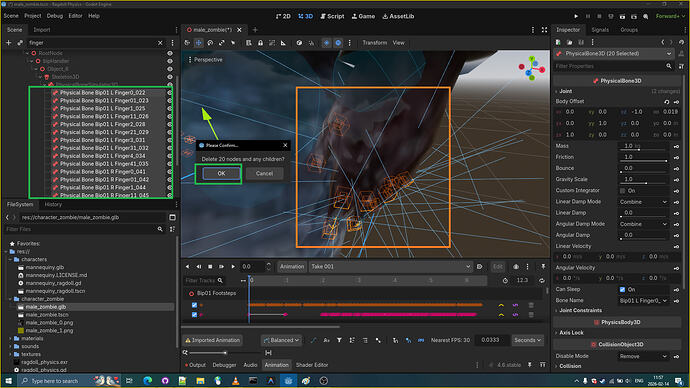
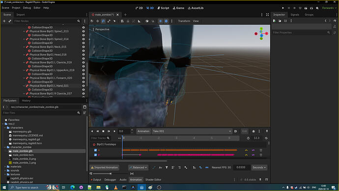

31. Overall it should now look like this. We simply resized the physical bones to match and sometimes outfit the meshes. We removed fingers and resized hand physical bone CollisionShape3D and moved the hand PhysicalBone3D to out match the fingers.

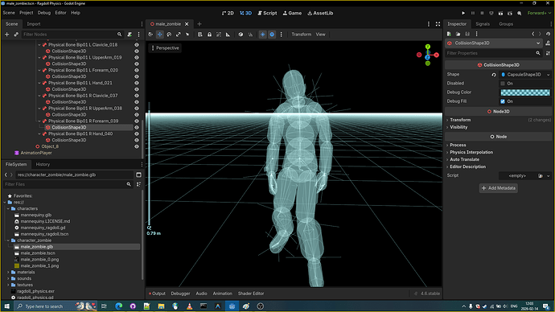

32. Time to introduce our Zombie to the Godot Ragdoll Demo.
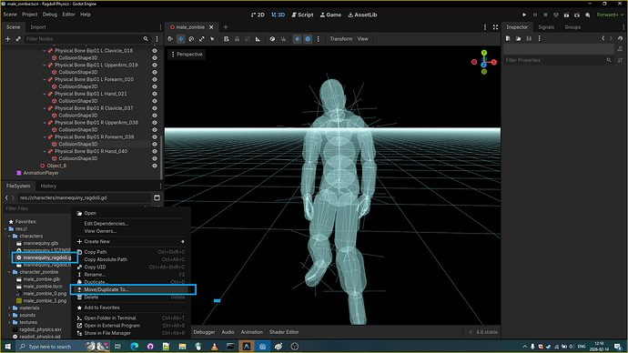
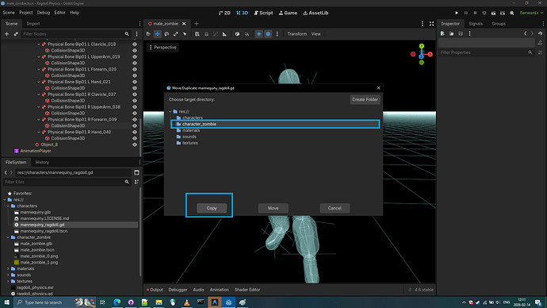

I simply replaced all **node paths** in the script of original `mannequiny_ragdoll.gd` and attached the script to the zombie's scene very first node. I also copied the sound nodes.  And finally the zombie started to work like the regular mannequiny ragdoll but **without joint constraints and with join type of pinjoint instead of conejoints.**


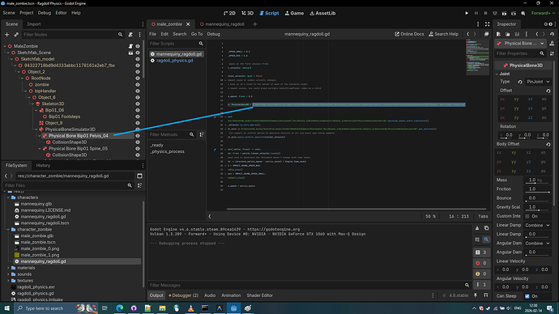
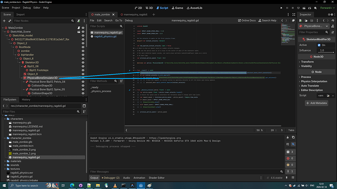


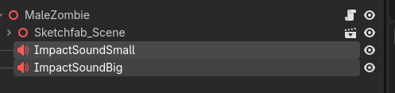


[details="Zombie mannequiny_ragdoll.gd"]

```
extends Node3D

const IMPACT_SOUND_SPEED_SMALL = 0.3
const IMPACT_SOUND_SPEED_BIG = 1.0

## The velocity to apply on the first physics frame.
@export var initial_velocity: Vector3

var has_applied_initial_velocity: bool = false
# Used to play an impact sound on sudden velocity changes.
# We use the pelvis bone as it's close to the center of mass of the character model.
# For more detailed impact sounds, you could place multiple AudioStreamPlayer nodes as a child
# of each limb.
var previous_pelvis_speed: float = 0.0

@onready var pelvis: PhysicalBone3D = $"Sketchfab_Scene/Sketchfab_model/94322718bd9d4333abbc1178161a2eb7_fbx/Object_2/RootNode/bipHandler/Object_6/Skeleton3D/PhysicalBoneSimulator3D/Physical Bone Bip01 Pelvis_04"


func _ready() -> void:
	$"Sketchfab_Scene/Sketchfab_model/94322718bd9d4333abbc1178161a2eb7_fbx/Object_2/RootNode/bipHandler/Object_6/Skeleton3D/PhysicalBoneSimulator3D".physical_bones_start_simulation()
	if not initial_velocity.is_zero_approx():
		for physical_bone in $"Sketchfab_Scene/Sketchfab_model/94322718bd9d4333abbc1178161a2eb7_fbx/Object_2/RootNode/bipHandler/Object_6/Skeleton3D/PhysicalBoneSimulator3D".get_children():
			# Give the ragdoll an initial motion by applying velocity on all its bones upon being spawned.
			physical_bone.apply_central_impulse(initial_velocity)


func _physics_process(_delta: float) -> void:
	var pelvis_speed: float = pelvis.linear_velocity.length()
	# Ensure the speed used to determine the threshold doesn't change with time scale.
	var impact_speed := (previous_pelvis_speed - pelvis_speed) / Engine.time_scale
	if impact_speed > IMPACT_SOUND_SPEED_BIG:
		$ImpactSoundBig.play()
	elif impact_speed > IMPACT_SOUND_SPEED_SMALL:
		$ImpactSoundSmall.play()

	previous_pelvis_speed = pelvis_speed

```
[/details]


33. Making zombie spawn with spacebar in the Godot Ragdoll Demo.
  We simply open **ragdoll_physics.gd** script and change `var ragdoll` variable scene file path.


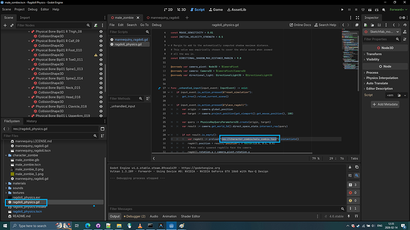

34. Spawning our zombie ragdolls using space bar key: let's run the `ragdoll_physics.tscn` scene. 


35. As we can see the ragdoll kind of works, but still doesn't feel right. That's because we use **pinjoints** for all physical bones instead of **conejoints**.

36. Let's use **conejoints** for all physical bones of the zombie. Select all the PhysicalBones.
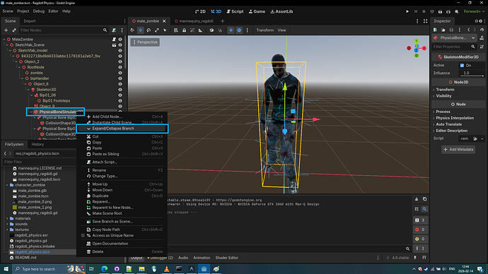
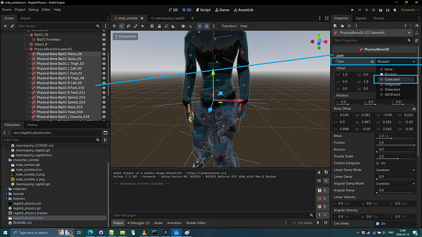

37. Let's apply joint constraints to all physical bones too.
joint_constraints/swing_span: 20.0
joint_constraints/twist_span: 20.0

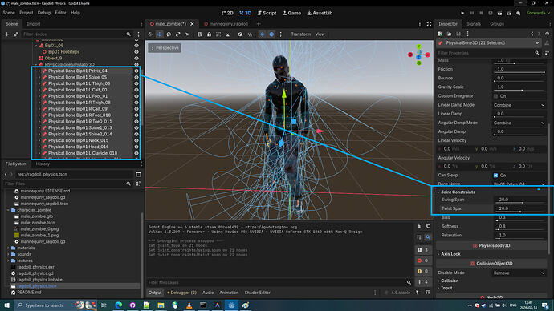

38. And do not forget to set for all physical bones the  friction to 0.8 and bounce to 0.6, but it is not necessary..

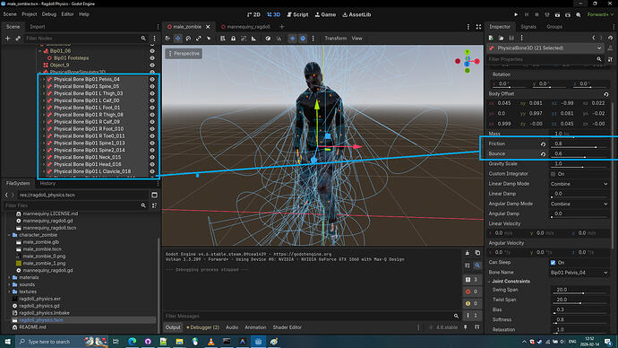


39. The final result demonstration


---

### The step we skipped (Prot tip)

Protip:  Retarget **male_zombie.glb**  skeleton as humanoid skeleton.
If this model was base model for others we would have to first retarget the Skeleton and click reimport before trying to make a ragdoll. However since this is a single zombie and not general zombie model, we didn't do this step, but it is recommended for Quaternius model. Also transfering the Physical skeleton is not possible without a supporting script that preserves attributes to the physical bones nodes. This is a godot bug.

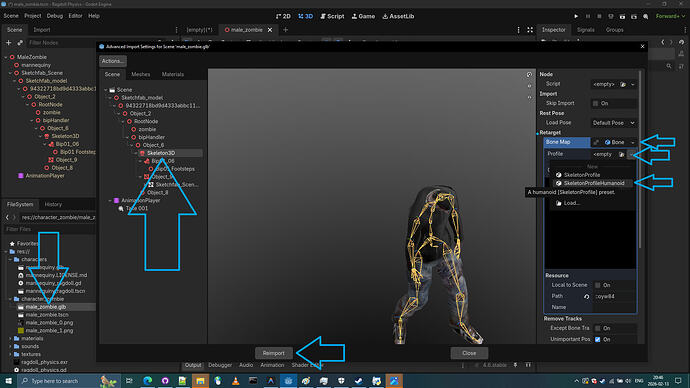